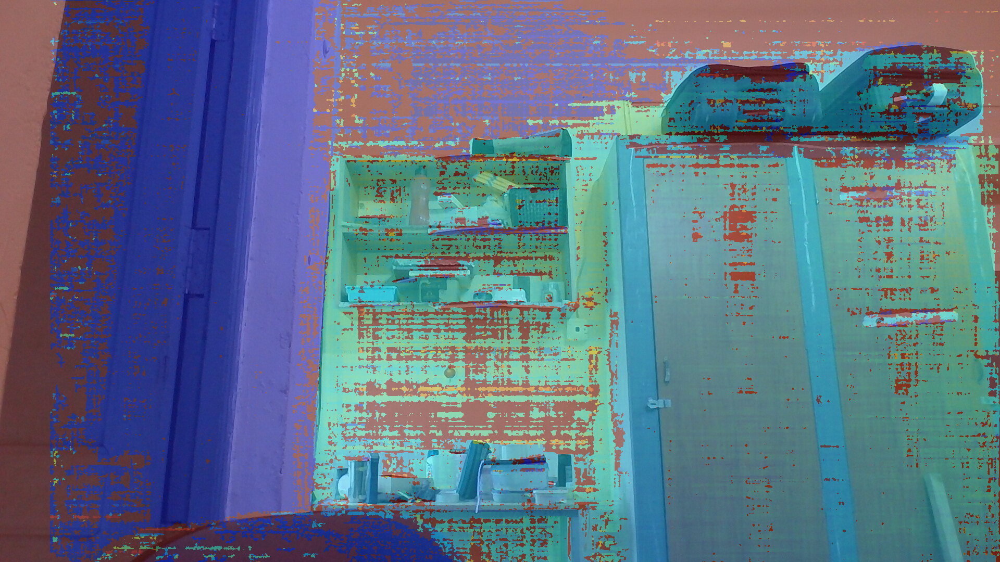
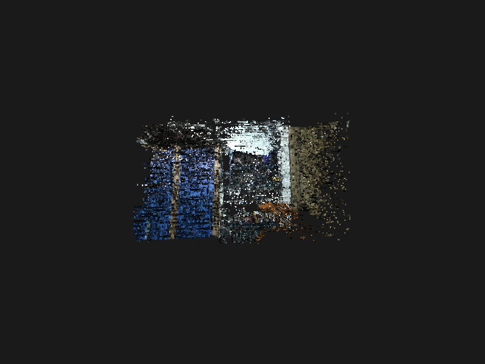

# ESP Stereo Camera Project

## Overview
This project demonstrates a low‑cost stereo vision system using two ESP32‑CAM modules. The cameras stream JPEG frames over Wi‑Fi to a laptop, where a Python script timestamps each frame, matches left/right pairs, computes disparity, and reconstructs a 3‑D point cloud.

## Hardware
- Two ESP32‑CAM modules (OV2640/OV3660)
- An additional ESP32 to synchronize the camera modules
- A laptop, or comparable computer to run python and process the images
- A common wifi or laptop's hotspot

## Software
- **esp32_camera_udp.ino** – firmware for each ESP32‑CAM: captures JPEG images, timestamps them with `esp_timer_get_time()`, streams via UDP, and can be hardware‑triggered via a sync pin.
- **esp32_sync_master.ino** – sketch for a third ESP32 that outputs a periodic TTL pulse (default 30 Hz, 50 % duty) to synchronize the two cameras.
- **receive_stereo.py** – Python script that receives the UDP streams, reassembles JPEGs, extracts timestamps, matches frames within ±5 ms, decodes images, computes disparity (StereoSGBM), back‑projects to a 3‑D point cloud, and visualises or saves the result.

## Example Result
The example images `example/2026-06-24-2-left.jpg` and `example/2026-06-24-2-right.jpg` (exactly 3 inches apart) were processed with the pipeline above.

- **Depth overlay:** `example/depth_overlay2.png` – left image with a colour‑coded depth map blended in (warmer colours = closer objects).
- **Point cloud preview:** `example/review.png` – rendered view of the coloured point cloud (with normals and outlier removal applied).
- The full coloured point cloud is available as `example/review.ply`.




## How to Use
1. Upload `esp32_camera_udp.ino` to both ESP32‑CAM modules.
2. Upload `esp32_sync_master.ino` to a third ESP32 and connect its GPIO output (default GPIO4) to the `SYNC_PIN` of each camera.
3. Run the receiver on your laptop:
   ```bash
   python3 receive_stereo.py \
       --left_ip 192.168.1.101 \
       --right_ip 192.168.1.102 \
       --port 5005 \
       --baseline 0.0762 \
       --fx 400.0 --fy 400.0 --cx 320 --cy 240 \
       --max_disparity 96 \
       --window display   # or --window save --output_pc cloud.ply
   ```
4. View the live point cloud (or save it for later inspection).

## License
This project is open‑source and available under the MIT License.